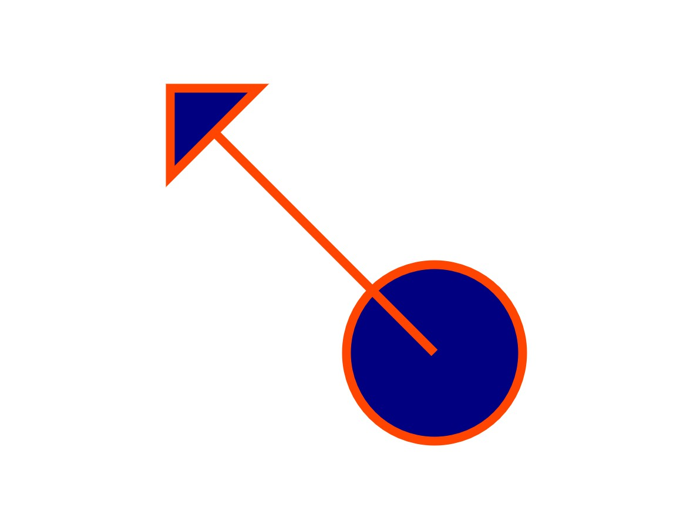

# OOP with C++ (and more)
#### Spring, 2019
#### Prof Y C Cheng
#### Dept of Computer Science and Information Engineering
#### Taipei Tech

## Assignment 8

### Due: 11:59 p.m., 26 MAY 2019


**For this assignment, please put all your code in svg_shape.h, svg_line.h, svg_circle.h, svg_polygon.h**


### Purpose of this assignment:
Let students practice to implement a polymorphism structure.  

### Problems:
For this assignment, please implement the classes, according to the [given unit tests](unit_test.zip), to generate SVG format string of each shapes, and make sure all the given unit tests pass.

You'll have to implement the following shapes: line, circle, polygon.

**For SVG usage, please refer:**[SVG tutorial](https://www.w3schools.com/graphics/svg_polygon.asp)

### Important:
1. Please add **xmlns="http://www.w3.org/2000/svg"** in to **svg** tag, which looks like:
**\<svg xmlns="http://www.w3.org/2000/svg"  ......\>**
2. Please do not add any **public** method.

### Out put:
You'll get Shapes.svg file in your work space after your unit tests executed successfully. You could open the SVG file with your browser, and it should looks like the following image:


### Prototype of Prism:
#### svg_shape.h
```
    class SvgShape {
    public:
        SvgShape(){ ... }
        void setFillColor(std::string fillColor) { ... }
        void setStroke(double strokeWidth, std::string strokeColor) { ... }
        virtual std::string toSVG() const = 0;
    protected:
        ...
    private:
        double _strokeWidth;
        std::string _fillColor, _strokeColor;
    };
    void setSvgShapeStyle(SvgShape * shape, double strokeWidth, std::string strokeColor, std::string fillColor){ ... }
    std::string makeSvgOutput(int width, int height, std::vector<SvgShape *> const & shape){ ... }
```
#### svg_polygon.h
```
    class SvgPolygon : public SvgShape {
    public:
        SvgPolygon(std::vector<double *> const & v): ... { ... }
        std::string toSVG() const { ... }
    private:
        std::vector<double *> _v;
    };
```
#### svg_line.h
```
    class SvgLine : public SvgShape {
    public:
        SvgLine(double x1, double y1, double x2, double y2): ... { ... }
        std::string toSVG() const { ... }
    private:
        double _x1, _y1, _x2, _y2;
    };
```
#### svg_circle.h
```
    class SvgCircle : public SvgShape {
    public:
        SvgCircle(double x, double y, double r): ... { ... }
        std::string toSVG() const { ... }
    private:
        double _x, _y, _r;
    };
```

Note:
1. Please implement your test cases reasonably, or you will get no point for that sub-problem.
2. for float number test, you should use ASSERT_NEAR(EXPCET, ACTUAL, ALPHA) instead of ASSERT_EQ(EXPCET, ACTUAL)
3. **\_TA project** will be used in this assignment
