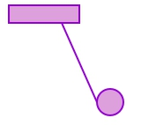

# OOP with C++ (and more)
#### Spring, 2019
#### Prof Y C Cheng
#### Dept of Computer Science and Information Engineering
#### Taipei Tech

## Assignment 10

### Due: 11:59 a.m., 16 June 2019

### Problems:

### Purpose of this assignment:
Let students practice to implement the logical shape and svg shape together with python.  

### Problems:
In assignment 7 and 8, we have writen logical shape and svg shape class with c++, now we want to implement the same function with python.

You'll have to implement the following shapes: line, circle, rectangle.

**For SVG usage, please refer:**[SVG tutorial](https://www.w3schools.com/graphics/svg_polygon.asp)

**Important:** Please add **xmlns="http://www.w3.org/2000/svg"** in to **svg** tag, which looks like:
**\<svg xmlns="http://www.w3.org/2000/svg"  ......\>**

### Out put:
You'll get `shapes.svg` file in your work space after running the TA test. You could open the SVG file with your browser, and it should looks like the following image:

Please write **unit tests** in "**ut_shape.py**", and implement two classes, the class "**Circle**" in "**circle.py**" file, the class "**Line**" in "**line.py**" file, the class "**Rectangle**" in "**rectangle.py**" file, the class "**Shape**" in "**shape.py**" file, according to the following requirements.

**Prototypes of classes and functions:**

    class Circle(Shape):
        def __init__(self, radius, centerPoint = [0, 0]):
        def area(self):
        def perimeter(self):
        def toSVG(self):

    =============================================================================================

    class Line(Shape):
        def __init__(self, vector, centerPoint = [0, 0]):
        def area(self):
        def perimeter(self):
        def toSVG(self):
    #vector: 同時代表著方向和長度
    #perimeter: 線段長度

    =============================================================================================

    class Rectangle(Shape):
        def __init__(self, width, height, centerPoint = [0, 0]):
        def area(self):
        def perimeter(self):
        def toSVG(self):

    =============================================================================================

    class Shape(ABC):
        def __init__(self, centerPoint):
        def setFillColor(self, fillColor):
        def setStroke(self, strokeWidth, strokeColor):
        def getFillColor(self):
        def getStrokeWidth(self):
        def getStrokeColor(self):
        @abstractmethod
        def toSVG(self):
        @abstractmethod
        def area(self):
        @abstractmethod
        def perimeter(self):
    def makeSvgOutput(width, height, shapeList):

**part of TA test:**

    class TestSvgOutput(unittest.TestCase):
        def test_make_svg_output(self):
            shapes = [Circle(15, [125, 120]), Rectangle(80, 20, [50, 20]), Line([40, 90], [90, 75])]
            for shape in shapes:
                shape.setFillColor("plum")
                shape.setStroke(2, "darkviolet")
            file = open("shape.svg", "w")
            file.write(makeSvgOutput(500, 500, shapes))
            file.close()

**Note:**
1. Please implement your test cases reasonably, or you will get no point for that sub-problem.
2. **\_TA project** will be used in this assignment.
3. You need to use **ut_main.py** to manage your test file.
