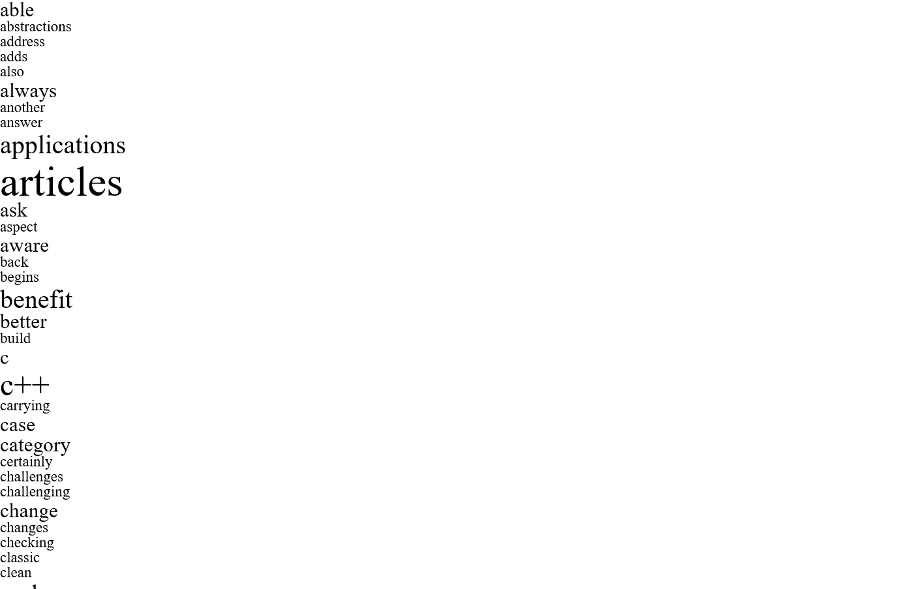

# OOP with C++ (and more)
#### Spring, 2019
#### Prof Y C Cheng
#### Dept of Computer Science and Information Engineering
#### Taipei Tech

# Final Exam

### Date: 10:10 a.m. ~ 13:00 p.m., 17 June 2019

### Problems:
Word frequency analysis for article with python:

In an article, the frequency of a word is the number of times that a word shows up in the article.
In the final exam, you will get a number of articles and you need to count the frequencies of words (not including stop words such as 'a', 'is', 'the', etc.) for each one of them.

Moreover, output a Word Cloud diagram in svg format to visualize the frequency result.

### Output:
You'll get `word_cloud.svg` file in your work space after running the TA test. You could open the SVG file with your browser, and it should looks like the following image:

Please write **unit tests** in "**ut_article.py**", and implement two classes, the class "**Article**" in file "**article.py**", the class "**WordCloud**" in file "**wordcloud.py**", according to the following requirements.

- The class "**Article**" loads an article from a text file, split the article to word list, converts all capital letters to lower case letters, removes the stop words, and computes the frequencies of the words that remain.

- The class "**WordCloud**" loads frequency results from the "**Article**" object, sorts the words alphabetically, and outputs a svg file that contains each non-stop word in input article such that words with higher frequencies are shown in larger font sizes than words with lower frequencies.

**Prototypes of classes and functions:**

    class Article():
        def __init__(self, file_name):  (15%)
        def isStopWord(self, word):     (25%)
        def getFrequencyResult(self):   (30%)
            ''' return a dictionary using word as key and frequency as value. '''

    =============================================================================================

    class WordCloud():
        def __init__(self, article):    (10%)
        def toSVG(self):                (20%)
            ''' return a string in svg format. (note: need to follow the format written in TA's sample svg file). '''

**List of stop words:**

    i, me, my, myself, we, our, ours, ourselves, you, your, yours, yourself, yourselves, he, him, his, himself, she, her, hers, herself, it, its, itself, they, them, their, theirs, themselves, what, which, who, whom, this, that, these, those, am, is, are, was, were, be, been, being, have, has, had, having, do, does, did, doing, a, an, the, and, but, if, or, because, as, until, while, of, at, by, for, with, about, against, between, into, through, during, before, after, above, below, to, from, up, down, in, out, on, off, over, under, again, further, then, once, here, there, when, where, why, how, all, any, both, each, few, more, most, other, some, such, no, nor, not, only, own, same, so, than, too, very, s, t, can, will, just, don, should, now

**List of split key word**

    """, "'", ".", ",", " ", "\n"

### Note:
1. Please implement your test cases reasonably, or you will get no point for that sub-problem.
2. **\_TA project** will be used in this assignment.
3. You need to use **ut_main.py** to manage your test file.
